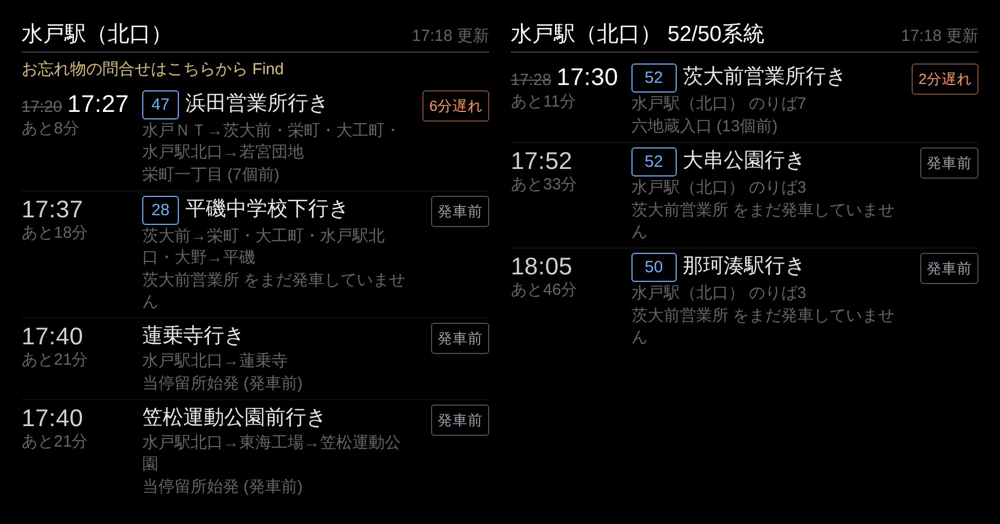

# MMM-ibako_busvision

茨城交通の [Bus-Vision](https://mc.bus-vision.jp/ibako/view/searchStop.html) から**バス接近情報**を取得して、MagicMirror² に「次のバスが何分後に来るか」を表示するモジュールです。



*左: `mode: "stop"`（バス停ごとの接近情報） / 右: `mode: "route"`（水戸駅を通過する 52・50 系統だけを時刻順に統合表示）*

---

## 特徴

- **発車前 / 走行中を正しく区別** — Bus-Vision は始発バス停を発車する前と発車した後で表示内容が変わります。本モジュールは両方の状態を検出し、発車前は「予定時刻 + 発車前」、走行中は「定刻・予測時刻 + 遅延分数 + 現在位置」を表示します。
- **系統リストモード（`mode: "route"`）** — 「水戸駅をこれから通過する 52 番と 50 番」のように、複数のりばをまたいで特定系統だけを 1 本の時刻順リストにまとめられます。
- **サーバに負荷をかけない設計** — 更新間隔の下限クランプ、プロセス全体のリクエスト直列化、指数バックオフ、ETag による条件付き GET、複数インスタンス間での取得結果の共有。詳細は[スクレイピングのマナー](#スクレイピングのマナーサーバ負荷対策)を参照。
- **タイムゾーン安全** — Bus-Vision は JST の壁時計時刻しか返しません。Docker などで UTC 動作している MagicMirror でも正しい残り時間を計算します。
- **依存パッケージゼロ** — Node.js 18+ の標準機能のみ（`npm install` 不要）。
- 日本語 / 英語の翻訳ファイル付き。

## データソースについて

| 項目 | 内容 |
| --- | --- |
| 取得先 | `https://mc.bus-vision.jp/ibako/view/approachSpecifiedStop.html` |
| 公式サイト | <https://mc.bus-vision.jp/ibako/view/searchStop.html> |
| 提供元 | 茨城交通株式会社 |
| API キー | **不要**（公開 HTML をスクレイピング） |
| 公式 API | ありません（HTML スクレイピングのみ） |
| 利用制限 | 明示的なレート制限は公表されていません。**本モジュールは自主的に 30 秒以上の間隔を強制しています。** |

> **注意**
> このモジュールは公式 API ではなく HTML スクレイピングで動作します。
> 茨城交通からスクレイピング自体は容認されていますが、**サーバに負荷をかけないことが前提**です。
> `updateInterval` を短くしすぎない（下限 30 秒、実用上は 60 秒以上を推奨）でください。
> サイト側の HTML 構造が変わると表示できなくなる可能性があります。

## インストール

```bash
cd ~/MagicMirror/modules
git clone https://github.com/Ryuto-dev/MMM-ibako_busvision.git
```

外部パッケージへの依存はないので `npm install` は不要です。MagicMirror を再起動してください。

## バス停コード（`stopCd` / `poleCd`）の調べ方

### 方法 1: Bus-Vision のサイトから URL を読む

1. <https://mc.bus-vision.jp/ibako/view/searchStop.html> でバス停を検索する
2. 「通過全車両接近表示」を開く
3. URL のパラメータをそのまま使う

```
https://mc.bus-vision.jp/ibako/view/approachSpecifiedStop.html?stopCdSpecified=345&poleCdSpecified=1&lang=0
                                                                              ^^^                ^
                                                                          stopCd: 345      poleCd: 1
```

`poleCd` は「のりば」の番号です。同じバス停でも上り / 下り、のりば違いで別コードになります。

### 方法 2: 付属の検索ツールを使う

```bash
cd ~/MagicMirror/modules/MMM-ibako_busvision
node tools/find-stop.js 東前団地 --check
```

`--check` を付けると各のりばに実際に接近情報が出るかを確認し、`config.js` に貼り付けられる形で出力します。
（内部で 0.8 秒間隔のリクエスト制限をかけています）

## 設定

### 最小構成

```js
{
  module: "MMM-ibako_busvision",
  position: "top_left",
  config: {
    stops: [
      { stopCd: 345, poleCd: 1, label: "東前団地西（上り）" }
    ],
    updateInterval: 60
  }
}
```

### 系統リストモード（`mode: "route"`）

「水戸駅（北口）をこれから通過する **52 番と 50 番**」を時刻順にリスト表示する例です。
水戸駅（北口）では 50 / 52 系統が **のりば 3 と のりば 7 の両方**に現れるため、両方を `stops` に指定します
（重複する便は自動的に除去され、時刻順に並べ替えられます）。

```js
{
  module: "MMM-ibako_busvision",
  position: "top_right",
  config: {
    mode: "route",
    routes: ["52", "50"],
    stops: [
      { stopCd: 51, poleCd: 3 },
      { stopCd: 51, poleCd: 7 }
    ],
    maxEntries: 6,
    showOriginPole: true,   // どののりばから来る便か表示
    updateInterval: 60
  }
}
```

### 設定項目

#### 表示モード

| オプション | 型 | 既定値 | 説明 |
| --- | --- | --- | --- |
| `mode` | string | `"stop"` | `"stop"`: バス停ごとにセクション分けして表示 / `"route"`: 複数のりばを統合し系統で絞り込んだ 1 本のリストにする |
| `routes` | array | `[]` | `mode: "route"` で表示する系統番号。`["52", "50"]` や `[52, 50]` のように文字列 / 数値混在も可。空配列なら全系統 |
| `filterRoutes` | boolean | `true` | `false` にすると `routes` による絞り込みを行わない |
| `title` | string | `null` | `mode: "route"` の見出し。`null` ならバス停名と系統番号から自動生成 |
| `showOriginPole` | boolean | `false` | `mode: "route"` で、便がどのバス停 / のりば発かを行内に表示する |

#### バス停と更新

| オプション | 型 | 既定値 | 説明 |
| --- | --- | --- | --- |
| `stops` | array | `[]` | 表示するバス停。`[{ stopCd, poleCd, label }]`。`label` 省略時はサイト上の名称を使用 |
| `updateInterval` | number | `60` | 更新間隔（秒）。**30 秒未満は 30 秒に切り上げられます** |
| `maxEntries` | number | `3` | 表示する便数。`mode: "stop"` は 1 バス停あたり、`mode: "route"` はリスト全体の件数 |
| `maxMinutes` | number | `0` | この分数より先の便を表示しない（`0` で無制限） |
| `keepPastMinutes` | number | `1` | 発車時刻を過ぎた便を何分間残すか |
| `showBeforeDeparture` | boolean | `true` | 始発を発車していない便も表示するか。`false` なら走行中の便のみ |

#### 表示内容

| オプション | 型 | 既定値 | 説明 |
| --- | --- | --- | --- |
| `timeFormat` | string | `"both"` | `"relative"`（あと 12 分） / `"absolute"`（13:54） / `"both"` |
| `highlightWithinMinutes` | number | `5` | 残り時間がこの分数以下なら強調表示 |
| `showHeaderPerStop` | boolean | `true` | バス停名の見出し |
| `showRouteNumber` | boolean | `true` | 系統番号バッジ |
| `showDestination` | boolean | `true` | 行先 |
| `showRouteName` | boolean | `false` | 経由（路線名）。長いので既定は非表示 |
| `showDelay` | boolean | `true` | 遅延 / 定刻の表示 |
| `showLocation` | boolean | `true` | 現在位置（走行中）/ 始発（発車前） |
| `showUpdateTime` | boolean | `true` | 最終更新時刻 |
| `showNotice` | boolean | `false` | Bus-Vision サイトのお知らせ |
| `showErrors` | boolean | `true` | 取得エラーを画面に表示する |
| `tickAnimation` | boolean | `true` | 残り時間を 1 秒ごとに再計算（サーバへのアクセスは発生しません） |
| `compact` | boolean | `false` | 補助情報を省いて幅を詰める（サイドカラム向け） |

## 発車前 / 走行中の表示の違い

Bus-Vision は、バスが始発バス停を発車する前と後で返す情報が変わります。本モジュールはこれを検出して表示を切り替えます。

| | 発車前 | 走行中 |
| --- | --- | --- |
| サイト上の状態 | `発車前` | `ほぼ定刻` / `約 N 分遅れ` |
| 時刻情報 | 予定時刻のみ（`13:54`） | 定刻 + 予測（`定刻13:13（予測13:24）`） |
| 位置情報 | 「〇〇 をまだ発車していません」 | 「〇〇（N個前）」 |
| 遅延 | 不明（未確定） | 分数で表示 |
| モジュールの表示 | 控えめな色 + `発車前` バッジ | 通常色 + 遅延バッジ、定刻に取り消し線 |

このため、**発車前の便の「あと N 分」はあくまで時刻表ベースの予定**で、実際の到着は前後します。走行中の便は予測時刻ベースなのでより正確です。

## スクレイピングのマナー（サーバ負荷対策）

茨城交通のサーバに負荷をかけないため、以下を実装しています。

1. **更新間隔の下限クランプ** — `updateInterval` が 30 秒未満なら 30 秒に引き上げます（設定ミスで毎秒アクセスすることを防止）
2. **プロセス全体のリクエスト直列化** — 同時アクセスを禁止し、どんな場合でもリクエスト間に最低 1.2 秒の間隔を空けます
3. **取得結果の共有** — 同じ `stopCd:poleCd` を複数のモジュールインスタンスが参照していても、取得は 1 回だけ
4. **条件付き GET** — `ETag` / `If-None-Match` を使い、更新がなければ `304` で本文を転送しません
5. **指数バックオフ** — 取得失敗時は間隔を倍々にし（最大 10 分）、障害中に連打しません
6. **起動時のスタガー** — 複数バス停の初回取得を 1.5 秒ずつずらします
7. **画面の再描画はローカル計算** — 「あと N 分」の 1 秒更新はローカル時計で行い、サーバにはアクセスしません
8. **正直な User-Agent** — モジュール名とリポジトリ URL を含む User-Agent を送信します

`suspend()` / `resume()` にも対応しているので、モジュールが非表示の間はポーリングを停止します。

## 開発

### テスト

実際に取得した HTML をフィクスチャとして保存し、パーサと表示ロジックを検証しています。

```bash
npm test
# または個別に
node test/parser.test.js       # パーサ (49 tests)
node test/route-mode.test.js   # 系統リストモード (21 tests)
```

タイムゾーン非依存であることの確認:

```bash
TZ=UTC node test/parser.test.js
TZ=Asia/Tokyo node test/parser.test.js
TZ=America/New_York node test/parser.test.js
```

### ブラウザ不要のプレビュー

MagicMirror を起動せずに表示を確認できる簡易サーバが付属しています。

```bash
# ライブデータで確認
node tools/preview.js --port 3000 --stops 345:1

# 系統リストモードも一緒に確認
node tools/preview.js --port 3000 --stops 51:3,51:7 --routes 52,50

# 保存済み HTML（オフライン）で確認
node tools/preview.js --port 3000 --fixture test/fixtures/running.html
```

### ファイル構成

```
MMM-ibako_busvision.js   フロントエンド（表示ロジック）
node_helper.js           バックエンド（ポーリング / インスタンス多重化）
lib/parser.js            Bus-Vision HTML パーサ（依存なしの純粋関数）
lib/fetcher.js           レート制限付き取得レイヤ
css/                     スタイル
translations/            ja / en
test/                    テストと実 HTML フィクスチャ
tools/find-stop.js       バス停コード検索 CLI
tools/preview.js         ブラウザ不要のプレビューサーバ
```

## 既知の制限

- Bus-Vision の HTML は Teeda 製で `id` が重複している（HTML としては不正）ため、DOM パーサではなく専用の抽出ロジックを使っています。サイト改修で壊れる可能性があります。
- 発車前の便は予測時刻が存在しないため、残り時間は時刻表ベースになります。
- 系統番号がサイト側で空欄の便（`?` 表示）は `routes` による絞り込みの対象外になります。
- 深夜 24 時以降の表記（`24:30` など）は翌日 `00:30` として扱います。

## ライセンス

MIT

本モジュールは茨城交通株式会社の公式製品ではありません。バス接近情報の内容については Bus-Vision の表示を正としてご利用ください。
